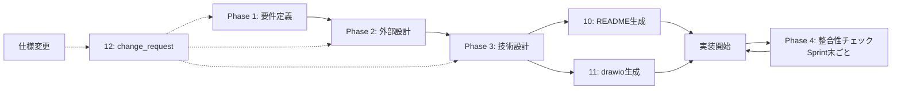

# 要件定義 コマンドセット v2

> ⚠️ このファイルは「索引」です。slash command としても呼び出せますが、Claude に作業させるためのファイルではありません。各コマンドの目的・使う順序・成果物の関係を確認するために読みます。

---

## 何ができるか

新規プロダクト開発の **要件定義 → 外部設計 → 技術設計 → 実装ガイド → 運用** の流れを、
対話型 AI エージェントとして段階実行します。
さらに **drift 検出 / README 自動生成 / drawio 図表 / 仕様変更ワークフロー** を備えています。

---

## コマンド一覧

| 順 | コマンド | 役割 | 入力 | 主要出力 |
|----|---------|------|------|---------|
| 0 | `/要件定義/00_README` | この索引（実行不要） | - | - |
| 1 | `/要件定義/01_phase1_要件定義` | 業務理解・ユーザー像・機能・画面・受入基準 | User との対話 | `docs/01_要件定義/`, `docs/00_共通/` |
| 2 | `/要件定義/02_phase2_外部設計` | DB・API・権限・画面・非機能・テスト戦略 | Phase 1 の成果物 | `docs/02_外部設計/` |
| 3 | `/要件定義/03_phase3_技術設計` | アーキ・ディレクトリ・運用・Sprint・ローンチ | Phase 1-2 の成果物 | `docs/03_技術設計/` |
| 4 | `/要件定義/04_phase4_整合性チェック` | 仕様⇄コードの drift 検出 | docs + 実コード | `docs/04_整合性チェック/reports/` |
| 10 | `/要件定義/10_doc_README生成` | README/ONBOARDING/CONTRIBUTING 等 | Phase 1-3 の成果物 | `README.md`, `docs/INDEX.md`, etc |
| 11 | `/要件定義/11_doc_drawio生成` | チーム共有用の drawio 図表パック | Phase 1-3 の成果物 | `docs/diagrams/*.drawio` |
| 12 | `/要件定義/12_change_request` | 仕様変更の影響分析と一括反映 | 変更内容の自然言語 | docs 全体の差分パッチ |

---

## 標準的な進め方

### 新規プロジェクト立ち上げ時

```
1. /要件定義/01_phase1_要件定義      ← 数時間〜数日（要件のヒアリング）
2. /要件定義/02_phase2_外部設計      ← 数時間（Phase 1 成果物ベース）
3. /要件定義/03_phase3_技術設計      ← 数時間（Phase 1-2 ベース）
4. /要件定義/10_doc_README生成        ← README/ONBOARDING/CONTRIBUTING を一気に
5. /要件定義/11_doc_drawio生成        ← drawio 図表パック（チーム共有用）
   →  この時点で「他の人がリポジトリを clone して開発を始められる状態」
6. 実装に入る（Sprint 1, 2, ...）
```

### Sprint 中・実装中

```
- Sprint 末ごと: /要件定義/04_phase4_整合性チェック    ← drift を検出
- 仕様変更が来たら: /要件定義/12_change_request        ← 影響波及を一括処理
```

---

## 成果物の全体構造（v2）

```
{プロジェクトルート}/
├── README.md                            ← 10 で生成
├── CONTRIBUTING.md                      ← 10 で生成
├── .env.example                         ← 10 で生成
└── docs/
    ├── INDEX.md                         ← 10 で生成（読む順案内）
    ├── ONBOARDING.md                    ← 10 で生成（30 分で動くまで）
    ├── STAKEHOLDER_OVERVIEW.md          ← 10 で生成（非エンジニア向け 1 枚絵）
    ├── 00_共通/
    │   ├── 用語集_glossary.md
    │   ├── 決定事項ログ_decision-log.md
    │   ├── リスク登録簿_risks.md
    │   └── 変更履歴_changelog.md         ← 12 が更新する
    ├── 01_要件定義/
    │   ├── 00_サマリー.md
    │   ├── 01_業務理解.md
    │   ├── 02_ユーザー像.md
    │   ├── 03_スコープ.md
    │   ├── 04_画面遷移図.md
    │   ├── features/                    ← 1 機能 1 ファイル
    │   │   ├── FR-01_ユーザー登録.md
    │   │   └── FR-02_*.md
    │   └── _index.yml                   ← 機械可読インデックス
    ├── 02_外部設計/
    │   ├── 00_サマリー.md
    │   ├── 01_DB設計.md
    │   ├── 02_API仕様.md
    │   ├── 03_権限設計.md
    │   ├── 04_画面設計.md
    │   ├── 05_非機能要件.md
    │   ├── 06_テスト戦略.md              ← v2 新規
    │   └── _index.yml
    ├── 03_技術設計/
    │   ├── 00_サマリー.md
    │   ├── 01_アーキテクチャ.md
    │   ├── 02_ディレクトリ構成.md
    │   ├── 03_外部サービス.md
    │   ├── 04_認証フロー.md
    │   ├── 05_開発ガイドライン.md
    │   ├── 06_運用設計.md                ← v2 新規（observability）
    │   ├── 07_Sprint計画.md
    │   ├── 08_ローンチ計画.md            ← v2 新規
    │   └── _index.yml
    ├── 04_整合性チェック/
    │   └── reports/
    │       └── sprint-{N}_{date}.md     ← 04 が生成
    └── diagrams/
        ├── *.drawio                     ← 11 が生成
        └── png/
            └── *.png
```

---

## v1 → v2 の主な変更点

| 観点 | v1 | v2 |
|------|----|----|
| 機能定義 | `03_機能一覧.md` 1 本にすべて | `features/FR-XX.md` per-feature 分割 |
| AI 用インデックス | なし | `_index.yml` を各 Phase に併走 |
| drift 検出 | なし | Phase 4 で機械的に検出 |
| README 等 | 言及のみ | `10_doc_README生成` で自動生成 |
| 図表 | Mermaid のみ | `11_doc_drawio生成` で drawio も |
| 仕様変更 | 都度手動 | `12_change_request` で影響分析・一括反映 |
| テスト戦略 | Phase 3 ガイドライン内に薄く | Phase 2 に独立 Doc |
| 運用設計 | なし | Phase 3 に追加（observability, runbook） |
| ローンチ計画 | なし | Phase 3 に追加 |
| AI ペルソナ | なし | Phase 1 ユーザー像に明示 |

---

## ID 規約（v2 共通）

| 接頭辞 | 対象 | 例 |
|--------|------|-----|
| `FR-` | 機能要件 | FR-01 |
| `BR-` | ビジネスルール | BR-01-01 |
| `AC-` | 受入基準 | AC-01-01 |
| `U-` | ユーザー種別 | U-01 |
| `SCR-` | 画面 | SCR-01 |
| `EP-` | API エンドポイント | EP-01 |
| `TBL-` | DB テーブル | TBL-users |
| `NFR-` | 非機能要件 | NFR-PERF-01 |
| `RISK-` | リスク | RISK-01 |
| `DEC-` | 決定事項 | DEC-01 |

**実装コードには `// @implements FR-01, AC-01-01` 形式のタグを必ず冒頭コメントに付与する**（Phase 4 が機械的に逆引きする）。

---

## 推奨運用フロー


